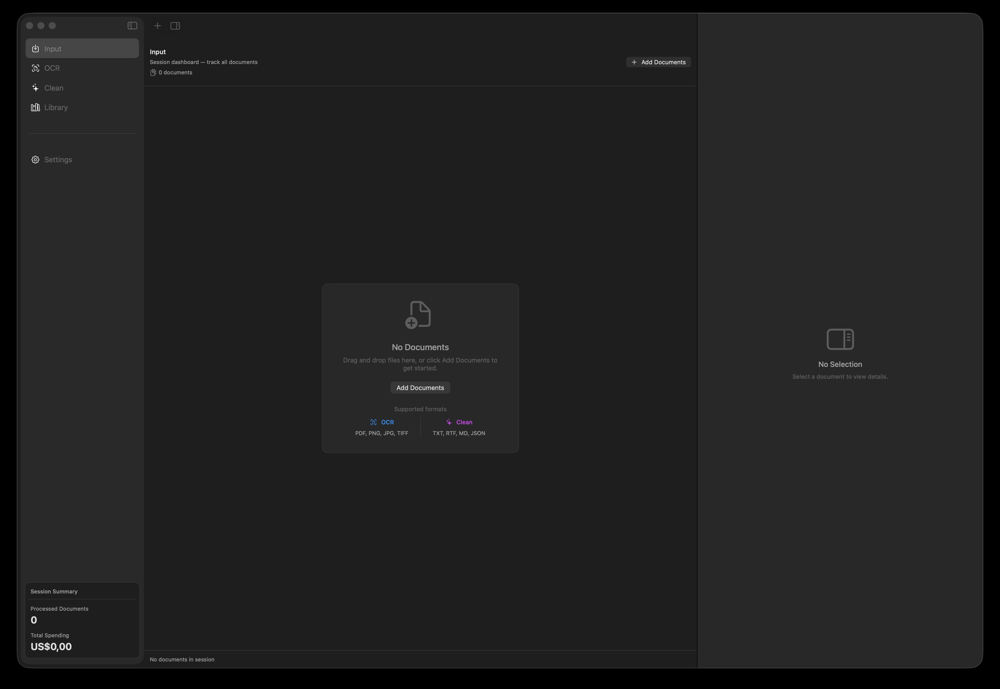
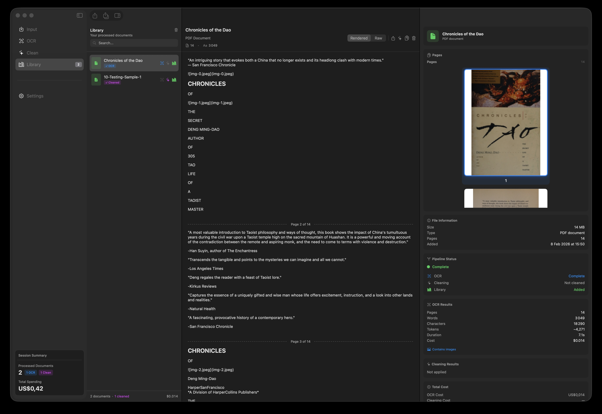
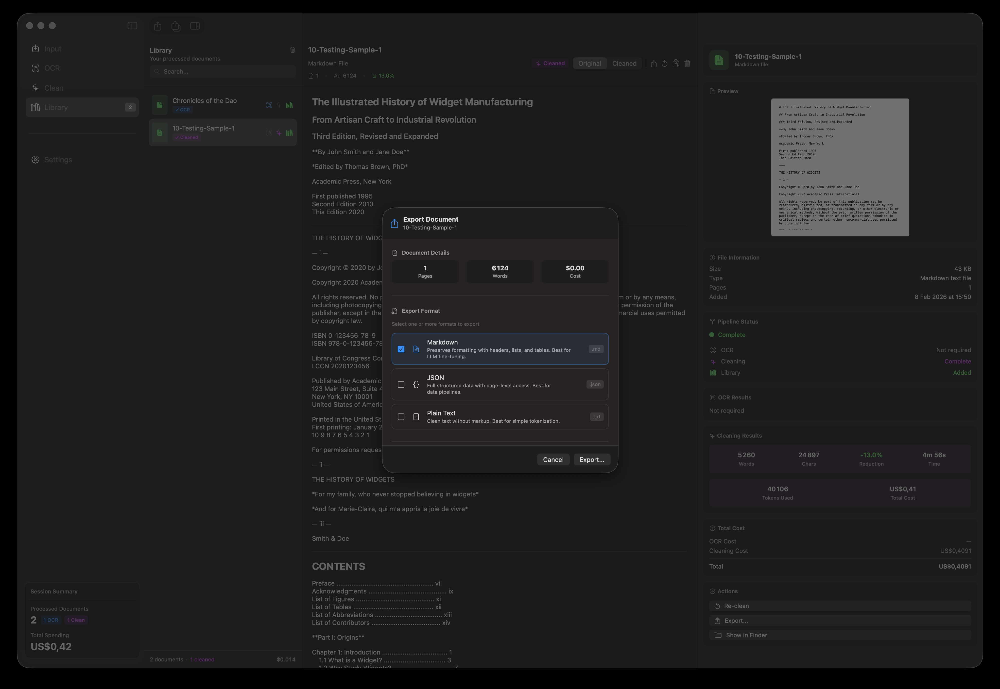

<p align="center">
  
</p>

<h1 align="center">Horus</h1>

<p align="center">
  <strong>Transforms documents into clean, AI-ready content</strong><br>
  <em>Powered by Mistral OCR and Claude</em>
</p>

<p align="center">
  A native macOS application that extracts text from documents using Mistral's OCR and transforms it into publication-ready content through Claude's intelligent cleaning pipeline.
</p>

<p align="center">
  
  
  
  
</p>

<p align="center">
  
</p>

---

## What is Horus?

**Horus** is a dual-API document processing application for macOS. It combines Mistral's advanced OCR capabilities with Claude's intelligent content analysis to transform raw documents into clean, structured content ready for AI training, research, or publication.

The application addresses a common challenge: OCR output is noisy. It contains page numbers, headers, footers, tables of contents, indexes, citations, and other structural scaffolding that gets in the way of the actual content. Horus removes this scaffolding intelligently—preserving what matters while eliminating what doesn't.

### The Two-Stage Pipeline

```
┌─────────────┐     ┌─────────────┐     ┌─────────────┐     ┌─────────────┐
│   Import    │ ──▶ │   Mistral   │ ──▶ │   Claude    │ ──▶ │   Export    │
│  PDF/Image  │     │     OCR     │     │  Cleaning   │     │  Markdown   │
└─────────────┘     └─────────────┘     └─────────────┘     └─────────────┘
                          │                    │
                    Text Extraction    Intelligent Cleanup
                    from documents     of scaffolding
```

**Stage 1: OCR Processing** — Mistral's vision model extracts structured text from PDFs and images with high fidelity.

**Stage 2: Intelligent Cleaning** — Claude's V3 pipeline analyzes document structure and removes scaffolding while preserving content integrity.

---

## ✨ What's New in v3.0.0

### Intelligent Content Cleaning

The headline feature of v3.0 is the **V3 Evolved Cleaning Pipeline**—a sophisticated 16-step process that transforms raw OCR output into publication-ready content:

- **Document Intelligence** — AI-powered structure analysis understands your document before cleaning it
- **Configurable Removal** — Toggle what gets removed: citations, footnotes, auxiliary lists, table of contents
- **Content Type Detection** — Automatic classification across 13 document types (academic, legal, technical, fiction, and more)
- **Processing Presets** — Four pre-configured profiles: Default, Training, Minimal, and Scholarly
- **Confidence Scoring** — Know how confident the system is in its cleaning decisions
- **Dual API Architecture** — Mistral handles OCR; Claude handles cleaning

### Additional Improvements

- **Direct-to-Clean Path** — Process text files (.txt, .rtf, JSON, XML, HTML) without OCR
- **Multiple Format Export** — Export to Markdown, JSON, and plain text simultaneously
- **Enhanced Progress Tracking** — Phase-based progress with confidence indicators
- **New Clean Tab** — Dedicated interface for the cleaning workflow

---

## Why Horus?

**For ML Data Engineers**
Prepare training datasets at scale. The Training preset strips everything but core content, outputting clean JSON ready for your data pipeline.

**For Research Curators**
Maintain scholarly integrity while removing structural noise. The Scholarly preset preserves citations and footnotes while eliminating indexes and front matter.

**For Content Operations**
Transform document archives into usable content. The Default preset provides balanced cleanup suitable for most document types.

### Key Capabilities

| Feature | Description |
|---------|-------------|
| **Batch Processing** | Queue up to 50 documents and process them all at once |
| **Intelligent Cleaning** | 16-step pipeline with configurable removal options |
| **Content Preservation** | >99% content integrity with confidence scoring |
| **Cost Transparency** | Know exactly what you'll pay before processing |
| **Privacy First** | API keys stored in Keychain; no telemetry |
| **Multi-Format Export** | Markdown, JSON, and plain text—simultaneously if needed |

---

## Screenshots

<table>
  <tr>
    <td align="center"><strong>Input</strong><br>Add documents and review before processing</td>
    <td align="center"><strong>OCR Results</strong><br>View extracted text with page navigation</td>
  </tr>
  <tr>
    <td></td>
    <td></td>
  </tr>
  <tr>
    <td align="center"><strong>Cleaning Pipeline</strong><br>Configure and run intelligent content cleaning</td>
    <td align="center"><strong>Cleaning Complete</strong><br>Review cleaned content with confidence scores</td>
  </tr>
  <tr>
    <td></td>
    <td></td>
  </tr>
  <tr>
    <td align="center"><strong>Library</strong><br>Browse and manage processed documents</td>
    <td align="center"><strong>Export Options</strong><br>Multiple format choices with metadata</td>
  </tr>
  <tr>
    <td></td>
    <td></td>
  </tr>
</table>

---

## Getting Started

### 1. Download & Install

Download the latest release from the [Releases](https://github.com/trodelli/Horus/releases) page:

1. Download `Horus-3.0.0.dmg`
2. Open the DMG and drag **Horus** to your Applications folder
3. Launch Horus

> **First Launch Note:** macOS may show a security warning for apps downloaded outside the App Store. Go to **System Settings → Privacy & Security** and click **"Open Anyway"**.

### 2. Configure API Keys

Horus requires two API keys:

**Mistral API** (for OCR)
1. Create an account at [console.mistral.ai](https://console.mistral.ai)
2. Navigate to **API Keys** and create a new key
3. Copy and paste into Horus Settings

**Anthropic API** (for Cleaning)
1. Create an account at [console.anthropic.com](https://console.anthropic.com)
2. Navigate to **API Keys** and create a new key
3. Copy and paste into Horus Settings

Both keys are stored securely in your Mac's Keychain.

### 3. Process Your First Document

1. **Add documents** — Drag PDFs or images into Horus, or click **Add Documents**
2. **Run OCR** — Process documents through Mistral's OCR engine
3. **Clean content** — Select a processed document and run the cleaning pipeline
4. **Configure cleaning** — Choose a preset or toggle individual cleaning steps
5. **Export** — Save as Markdown, JSON, plain text, or all three

---

## The Cleaning Pipeline

The V3 Evolved Cleaning Pipeline processes documents through 8 phases:

### Phase Architecture

| Phase | Purpose | Steps |
|-------|---------|-------|
| **A: Reconnaissance** | Analyze document structure with AI | Structure analysis, metadata extraction |
| **B: Verification** | Validate content before changes | Content verification checks |
| **C: Detection** | Identify structural elements | Heuristic boundary detection |
| **D: Structural Removal** | Remove scaffolding | Page numbers, headers/footers, front/back matter, TOC |
| **E: Reference Removal** | Clean references | Indexes, auxiliary lists, citations, footnotes |
| **F: Normalization** | Fix OCR artifacts | Special characters, Unicode normalization |
| **G: Optimization** | Improve readability | Paragraph reflow, length optimization |
| **H: Quality Assurance** | Final validation | Structure reconstruction, confidence scoring |

### Toggleable Steps

Four cleaning steps can be disabled for specialized workflows:

- **Table of Contents** — Keep TOC for documents where navigation matters
- **Auxiliary Lists** — Preserve figures, illustrations, abbreviation lists
- **Citations** — Essential for academic documents
- **Footnotes/Endnotes** — Preserve scholarly apparatus

### Processing Presets

| Preset | Best For | Configuration |
|--------|----------|---------------|
| **Default** | General cleanup | All toggleable steps enabled |
| **Training** | ML datasets | Maximum extraction, JSON output |
| **Minimal** | Light cleanup | Page numbers and headers only |
| **Scholarly** | Academic documents | Preserves citations and footnotes |

### Content Type Detection

Horus automatically detects document type to optimize processing:

Fiction · Non-Fiction · Academic · Technical · Poetry · Children's · Legal · Medical · Financial · Biography · History · Reference

---

## Supported Formats

### OCR Processing Path (Images → Text → Cleaning)

| Type | Extensions |
|------|------------|
| PDF | `.pdf` |
| Images | `.png` `.jpg` `.jpeg` `.tiff` `.gif` `.webp` `.bmp` |

### Direct-to-Clean Path (Text → Cleaning)

| Type | Extensions |
|------|------------|
| Plain Text | `.txt` |
| Rich Text | `.rtf` |
| Structured | `.json` `.xml` `.html` |

---

## Pricing

Horus is **free and open source**. You pay only for API usage:

### Mistral OCR

| Pages | Cost |
|-------|------|
| 10 | $0.01 |
| 100 | $0.10 |
| 1,000 | $1.00 |

**$0.001 per page** — Process a 100-page document for a dime.

### Claude Cleaning

| Words | Approximate Cost |
|-------|------------------|
| 1,000 | ~$0.01 |
| 10,000 | ~$0.10 |
| 100,000 | ~$1.00 |

Cleaning costs vary based on document complexity and selected processing steps. Horus displays cost estimates before processing.

---

## Keyboard Shortcuts

| Action | Shortcut |
|--------|----------|
| Add Documents | `⌘O` |
| Process All (OCR) | `⌘R` |
| Clean Selected | `⌘K` |
| Export Selected | `⌘E` |
| Export All | `⇧⌘E` |
| Copy to Clipboard | `⇧⌘C` |

<details>
<summary><strong>View all shortcuts</strong></summary>

| Action | Shortcut |
|--------|----------|
| Input Tab | `⌘1` |
| OCR Tab | `⌘2` |
| Library Tab | `⌘3` |
| Settings Tab | `⌘4` |
| Add to Library | `⌘L` |
| Delete Selected | `⌫` |
| Clear Queue | `⌘⌫` |
| Clear Library | `⇧⌘⌫` |
| Pause/Resume | `⇧⌘P` |
| Cancel | `⌘.` |
| Toggle Inspector | `⌥⌘I` |

</details>

---

## Building from Source

```bash
git clone https://github.com/trodelli/Horus.git
cd Horus
open Horus.xcodeproj
```

Press `⌘R` in Xcode to build and run.

**Requirements:**
- macOS 14.0 (Sonoma) or later
- Xcode 15.0+

---

## Tech Stack

| Component | Technology |
|-----------|------------|
| UI Framework | SwiftUI |
| State Management | Swift Observation (`@Observable`) |
| Persistence | SwiftData |
| Networking | Swift Concurrency (`async/await`) |
| Security | macOS Keychain Services |
| PDF Handling | PDFKit |
| OCR | Mistral AI (pixtral-large-latest) |
| Cleaning | Anthropic Claude (claude-sonnet-4-20250514) |

---

## Project Structure

```
Horus/
├── App/                    # App entry point and configuration
├── Core/
│   ├── Models/             # Data models (Document, CleaningConfiguration, etc.)
│   ├── Services/           # API clients, cleaning pipeline, persistence
│   ├── Errors/             # Error type definitions
│   └── Utilities/          # Extensions and helpers
├── Features/
│   ├── DocumentQueue/      # Input and queue management
│   ├── OCR/                # OCR processing views
│   ├── Cleaning/           # Cleaning pipeline interface
│   ├── Library/            # Document library
│   ├── Export/             # Export functionality
│   └── Settings/           # Configuration views
├── Shared/                 # Reusable UI components
└── Resources/              # Assets and localization
```

---

## Contributing

Contributions are welcome. Here's how:

1. Fork the repository
2. Create a feature branch (`git checkout -b feature/your-idea`)
3. Commit your changes (`git commit -m 'Add your idea'`)
4. Push to the branch (`git push origin feature/your-idea`)
5. Open a Pull Request

Please ensure your code follows the existing patterns and includes appropriate documentation.

---

## License

MIT License — see [LICENSE](LICENSE) for details.

Free to use, modify, and distribute.

---

## Acknowledgments

- [Mistral AI](https://mistral.ai) for their excellent OCR capabilities
- [Anthropic](https://anthropic.com) for Claude's intelligent document understanding
- Named after the [Eye of Horus](https://en.wikipedia.org/wiki/Eye_of_Horus) — the ancient Egyptian symbol of protection, health, and wisdom

---

<p align="center">
  <strong>DESIGN BY THEWAY.INK · BUILT WITH AI · MADE IN MARSEILLE</strong>
</p>

<p align="center">
  <a href="https://github.com/trodelli/Horus/releases">Download</a> ·
  <a href="https://github.com/trodelli/Horus/issues">Report Bug</a> ·
  <a href="https://github.com/trodelli/Horus/issues">Request Feature</a>
</p>
